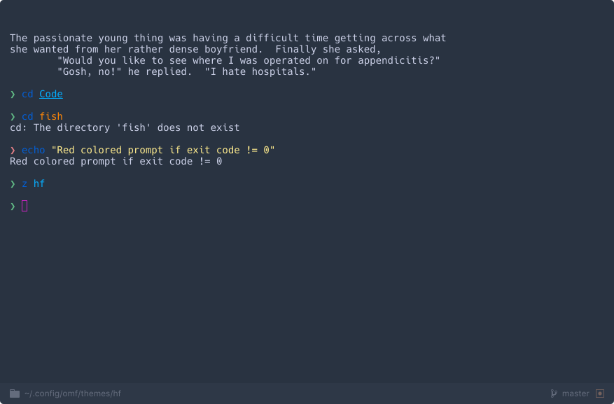

#### hf
> A theme for [fishshell][fish-link].

[](/LICENSE)
[](https://fishshell.com)
[](https://www.github.com/oh-my-fish/oh-my-fish)

<br/>


## Install

```fish
$ omf install hf
# Not working?
$ omf install https://github.com/lukasmalkmus/fish-theme-hf
```


## Features

* Minimal!
* Not git integration, no pwd, nothing!
* Red colored prompt if the last command exists with an exit code not equal to 0,
yay!

This theme won't be useful to most people. It doesn't have git integration like
most themes and doesn't show the current working directory.
I designed this theme to go hand in hand with my hyper setup. My terminal has
a status bar showing the pwd and git status and I wanted to avoid a cluttered
workspace. Check out the screenshot below.

It is possible do define an alternate prompt character with the provided
`hf_prompt_char` function.


## Screenshot

<p align="center">

</p>


# License

[MIT][mit] © [Lukas Malkmus][author] et [al][contributors]


[mit]:            https://opensource.org/licenses/MIT
[author]:         https://github.com/lukasmalkmus
[contributors]:   https://github.com/lukasmalkmus/fish-theme-hf/graphs/contributors
[fish-link]:      http://fishshell.com/
[omf-link]:       https://www.github.com/oh-my-fish/oh-my-fish

[license-badge]:  https://img.shields.io/badge/license-MIT-007EC7.svg?style=flat-square